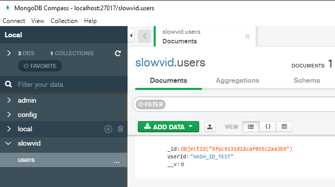

# SlowVid back-end 

💻 = Required for debugging  
▶️ = Required for running and debugging

## Project Setup

 1. Install the project's dependencies with: ▶️

    ```
    npm install
    ```

1. Install [MongoDB](https://www.mongodb.com/). ▶️

1. Install MongoDB Compass. 💻

1. Generate the back-end certificates (self-signed). 💻

    The certificates are used by the Health Care Professional front-end.
	Certificates are created into the `certificates` directory.

    ```
    npm run build
	npm run keygen gen
    ```

	To generate a `.pfx` (used by Microsoft Windows) run the above commands then:
    ```
	npm run keygen pkcs
    ```

## Run & Debug

1. Start the database server: ▶️

    ```
    ./mongod.exe --dbpath <path>
    ```
    `<path>` can be any location.

1. Start MongoDB Compass. 💻

    1. Enter New Connection, connection string: `mongodb://localhost:27017` 
    
        


1. Run dev server with: ▶️

    ```
    npm run dev
    ```

1. Then open your browser at the address shown. ▶️

1. View the data in MongoDB Compass. 💻  

    1. Press the refresh button.

    1. Select slowvid -> users

        

1. Debugging, see the detailed instructions [SlowVid Back-End Debugging](../doc/developer/README.md)

## Reset Development Environment

You can always trash the install and start fresh with:

```
rm -rf node_modules
rm -rf build
rm package-lock.json
npm install
```


## Conventions

### 1. camelCase

For variable, class and package names, prefer camelCase to kebab-case, snake_case or any other naming convention. 


### 2. prefer npm over yarn

Yarn is another common javascript package manager. 
We'll run into less issues if everyone uses npm.
