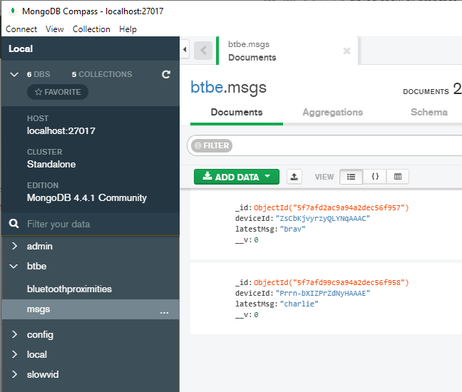

# SlowVid Bluetooth Back-end 

A Mock Bluetooth Back-end. SlowVid Front-end connects via Socket.io and emits
'broadcast' messages with data of type IBluetoothMsg. The 'broadcast' messages
are shared with all other SlowVid Front-ends if 'close-enough'. 'close-enough'
is set via the developer-use application 'Bluetooth Front-end'.

💻 = Required for debugging  
▶️ = Required for running and debugging

## Project Setup

 1. Install the project's dependencies with: ▶️

    ```
    npm install
    ```

1. Install [MongoDB](https://www.mongodb.com/). ▶️

1. Install MongoDB Compass. 💻

## Run & Debug

1. Start the database server: ▶️

    ```
    ./mongod.exe --dbpath <path>
    ```
    `<path>` can be any location.

1. Start MongoDB Compass. 💻

    1. Enter New Connection, connection string: `mongodb://localhost:27017` 
    
        


1. Run dev server with: ▶️

    ```
    npm run dev
    ```

1. Then open or refresh SlowVid Front-end and/or Bluetooth-Front-End. ▶️

1. View the data in MongoDB Compass. 💻  

    1. Press the refresh button.

    1. Select slowvid -> btbe

        

1. Debugging, see the detailed instructions [SlowVid Back-End Debugging](../doc/developer/README.md)

## Reset Development Environment

You can always trash the install and start fresh with:

```
rm -rf node_modules
rm -rf build
rm package-lock.json
npm install
```


## Conventions

### 1. camelCase

For variable, class and package names, prefer camelCase to kebab-case, snake_case or any other naming convention. 


### 2. prefer npm over yarn

Yarn is another common javascript package manager. 
We'll run into less issues if everyone uses npm.
