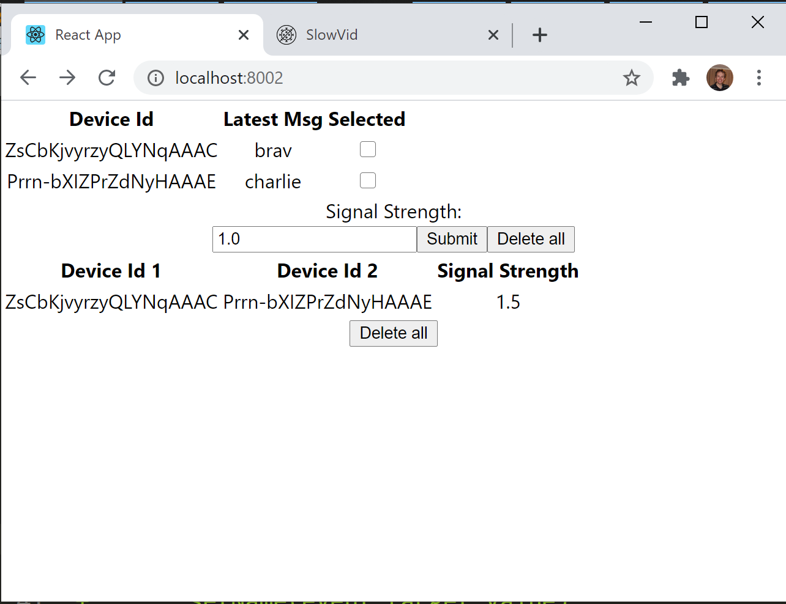

# SlowVid Bluetooth Front-end 

A Mock Bluetooth Front-end. Allows the developer to set if two mock Bluetooth
devices are 'close-enough' and specify the signal strength.



💻 = Required for debugging  
▶️ = Required for running and debugging

## Project Setup


 1. Install the project's dependencies with: ▶️

    ```
    npm install
    ```

## Run & Debug

1. Run the dev server with: ▶️

    ```
    npm start
    ```

1. Then open `http://localhost:8002/` in your browser. ▶️  
Chrome has better devtools for react. 

1. Debugging, see the detailed instructions [SlowVid Front-End Debugging](../doc/developer/README.md) 💻

## Reset Development Environment

You can always trash the install and start fresh with:

```
rm -rf node_modules
rm package-lock.json
npm install
```

## Conventions

### 1. Use [react hooks](https://reactjs.org/docs/hooks-intro.html) 

Where possible, prefer react hooks and functional components rather than class-based components. 
They are more modern and likely easier to learn. 

> We intend for Hooks to cover all existing use cases for classes, but we will keep supporting class components for the foreseeable future. At Facebook, we have tens of thousands of components written as classes, and we have absolutely no plans to rewrite them. Instead, we are starting to use Hooks in the new code side by side with classes.


### 2. camelCase

For variable, class and package names, prefer camelCase to kebab-case, snake_case or any other naming convention. 


### 3. prefer npm over yarn

Yarn is another common javascript package manager. 
We'll run into less issues if everyone uses npm.

## Technologies

Bootstrapped with [Create React App](https://github.com/facebook/create-react-app).
