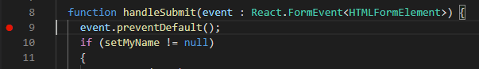
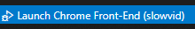
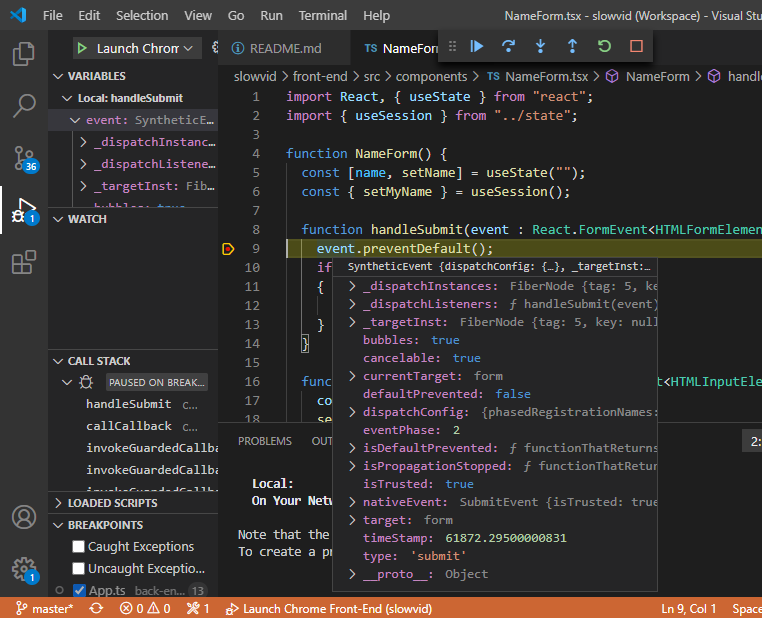
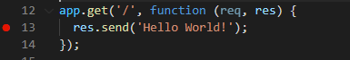
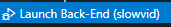
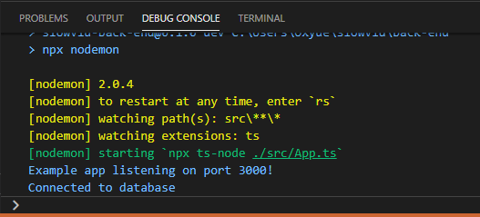
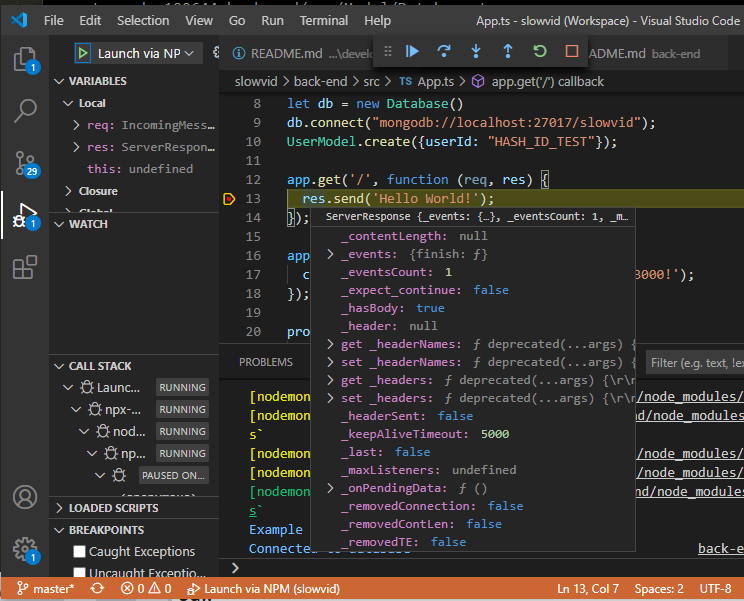

# SlowVid Front-End Debugging

1. Setup the development environment as per [REAME.md](../../front-end/README.md)

1. Install Chrome

1. Install [Visual Studio Code](https://code.visualstudio.com/)

1. In Visual Studio Code, install [Debugger for Chrome](https://marketplace.visualstudio.com/items?itemName=msjsdiag.debugger-for-chrome):
    1. Open `Extensions (Ctrl-Shift-X)`
    1. Search for `Debugger for Chrome`
    1. Install `Debugger for Chrome`

1. Set a breakpoint 🛑

    

1. Select configuration from status bar:  
(Visual Studio Code should pick-up the configuration from the [.vscode](../../.vscode) in github)

    

    Chrome will load. Trigger breakpoint.

1. Breakpoint hit. Inspect variables, call stack, etc.

    

1. Make code changes as required.  
No need to restart debugger. Save the changes and Chrome will reload automatically.

# SlowVid Back-End Debugging

1. Setup the development environment as per [REAME.md](../../back-end/README.md)

1. Install [Visual Studio Code](https://code.visualstudio.com/)

1. Set a breakpoint 🛑

    

1. Select configuration from status bar:  
(Visual Studio Code should pick-up the configuration from the [.vscode](../../.vscode) in github)

    

    

1. Connect via web browser (or SlowVid front-end)

1. Breakpoint hit. Inspect variables, call stack, etc.

    

1. Make code changes as required.  
No need to restart debugger. Save the changes and the debugger will reload automatically.