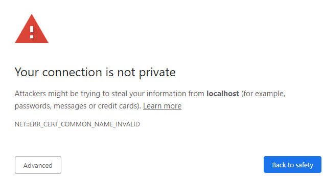
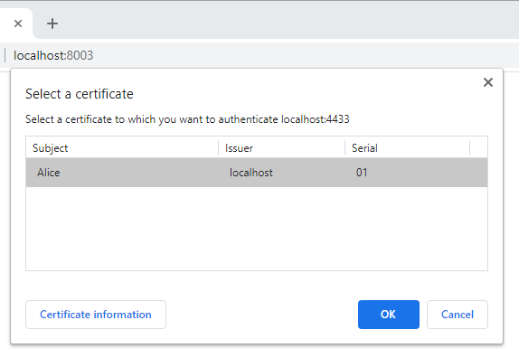

# Health Care Profession (HCP) front-end 

💻 = Required for debugging  
▶️ = Required for running and debugging

## Project Setup


 1. Install the project's dependencies with: ▶️

    ```
    npm install
    ```

1. If not already done, generate the back-end certificates (self-signed). ▶️

    See [SlowVid back-end README.md](../back-end/README.md)

1. Generate a HCP front-end certifcate. ▶️

	Certificates are created into the `../back-end/certificates` directory.

    ```
    cd ../back-end
	npm run build
	npm run keygen client <HCPName>
    ```
    Where \<HCPName\> is the HCP's name.

	To generate a `.pfx` (used by Microsoft Windows) run the above commands then:
    ```
	npm run keygen pkcs <HCPName>
    ```

1. Import the `backend_cert.pem` as a Trust Root Certification Authority (CA)

   1. On Microsoft Windows, use the `.pfx` file as per https://superuser.com/a/1182358/1235035

1. Import the `HCPName_cert.pem` as a Personal certificate

   1. On Microsoft Windows, use the `.pfx` file as per https://superuser.com/a/1182358/1235035

## Run & Debug

1. Run the dev server with: ▶️

    ```
    npm start
    ```

1. Then open `https://localhost:8003/` in your browser. ▶️  
Chrome has better devtools for react.

1. You will see a warning about self-signed certificate. Select Advanced, then accept the warning.

    

1. If using Chrome, Chrome will ask you to select your certificate:

    
	

## Reset Development Environment

You can always trash the install and start fresh with:

```
rm -rf node_modules
rm package-lock.json
npm install
```

## Conventions

### 1. Use [react hooks](https://reactjs.org/docs/hooks-intro.html) 

Where possible, prefer react hooks and functional components rather than class-based components. 
They are more modern and likely easier to learn. 

> We intend for Hooks to cover all existing use cases for classes, but we will keep supporting class components for the foreseeable future. At Facebook, we have tens of thousands of components written as classes, and we have absolutely no plans to rewrite them. Instead, we are starting to use Hooks in the new code side by side with classes.


### 2. camelCase

For variable, class and package names, prefer camelCase to kebab-case, snake_case or any other naming convention. 


### 3. prefer npm over yarn

Yarn is another common javascript package manager. 
We'll run into less issues if everyone uses npm.

## Technologies

Bootstrapped with [Create React App](https://github.com/facebook/create-react-app).
